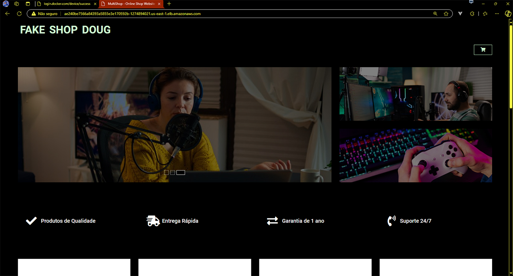
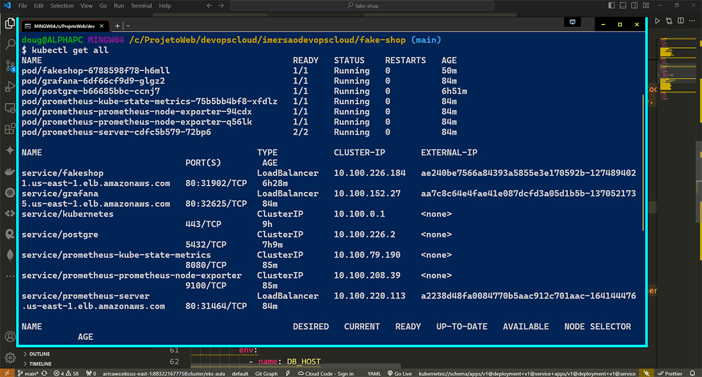

# Fake Shop Doug

## DESAFIO 2 - SITE :
[Fake Shop Doug](http://ae240be7566a84393a5855e3e170592b-1274894021.us-east-1.elb.amazonaws.com/)

<figure>
  
  <figcaption>Capa do site</figcaption>
</figure>

## DESAFIO 3 - PIPELINE CI/CD 

- Toda a estrutura do kubernets rodando na minha conta da aws.

<figure>
  
  <figcaption>Kubernets com todos os nos e as replicas</figcaption>
</figure>

### - DASHBOARD - Prometheus e Grafana:

- Dashboard do funcionamento do site Faker Shop Doug na ultima hora.

 <figure>
  
  <figcaption>Dashboard do site Fake Shop Doug</figcaption>
</figure>